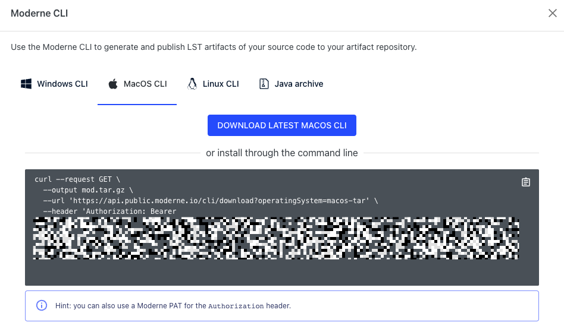

# Use the CLI to Migrate to Java 17 

In this adventure, you will use the [Moderne
CLI](https://docs.moderne.io/moderne-cli/cli-intro), a free tool that allows
developers to run OpenRewrite recipes without configuring any build plugin, to
migrate a repository to Java 17.

## Prepare your environment

1. Go to the [Moderne platform](https://app.moderne.io) and sign in.

2. Click on the `?` in the top right corner and then select `Moderne CLI` from
   the `Tools` menu:

   

3. You can then either press the `Download Latest` button or install it directly
   through the command line by copying the `curl` command at the bottom of the
   modal:

   

4. Regardless of how you downloaded the CLI, you'll need to save it somewhere
   that your terminal can access. This could involve updating your `PATH` to
   point to a specific location or this could involve putting it in a directory
   that's already on your `PATH` such as a `/usr/bin` directory.

5. Ensure you can run the CLI by typing `mod help`. If everything is set up
   correctly, you should see a list of commands:

   

6. Before you can run any commands, you'll need to create a Moderne Access
   Token. Go to
   [https://app.moderne.io/settings/access-token](https://app.moderne.io/settings/access-token),
   enter a name for the token, and press `generate`.

7. Once created, you should see a command that you can run to install the token
   on your system. Either run that command or export your token directly as an
   environment variable:

```shell
export MODERNE_ACCESS_TOKEN="mat-YOUR_TOKEN_HERE"
```

## Configure the repository example

1. Clone this repository

```shell
git clone https://github.com/moderneinc/java17-migration-workshop
```

2. Switch to Java 8 (or the JDK required to build your repository) so you can properly build this repository. 
You might need to download Java 8 and update your `JAVA_HOME` environment variable. If you are
on a Unix-based system, we recommend using [SDKMan](https://sdkman.io/):

```shell
sdk install java 8.0.372-tem
sdk use java 8.0.372-tem
```
  * If you want to use `sdk` and the `java 8.0.372-tem` distribution 
    is not available for you, select any distribution that represents a Java 8 version.
    
  * If you aren't on a Unix-based system or you don't want to install SDKMan,
    you'll need to install Java 8 and run something like:

```shell
export JAVA_HOME=REPLACE_FOR_LOCATION_OF_JAVA_8
```
If you are in a MacOS, you have an utility to list the existing JVMs running:

```shell
/usr/libexec/java_home -V
```

2. Clone this repository. In this example we will use an example repository

```shell
cd example
```

3. Ìt requires Maven. Please, make sure it runs on your machine:

```shell
mvn package -DskipTests
``` 

## Migrate to Java 17 using the Moderne CLI

1. Run the build command to generate the repository LST

```shell
mod build 
```

2. Now, switch to Java 17 to run recipes. This a Moderne CLI requirement.

```shell
export JAVA_HOME=REPLACE_FOR_LOCATION_OF_JAVA_17
```
 
3. Now it is time to migrate to Java 17. Use the following command from the `example` folder:

```shell
mod run --recipeName org.openrewrite.java.migrate.UpgradeToJava17 --recipeGAVs org.openrewrite.recipe:rewrite-migrate-java:2.0.6 --skipBuild --skipAnalytics
```

4. The previous command should have updates your source files. You can then see the changes made by running:

```shell
git diff
```
